# Практическая работа № 4 - Юркин В.И. - ПИМО-01-25

## Описание проекта
Проект представляет собой CRUD сервис для создания и просмотра задач.
Задачи сохраняются в json в корне проекта. Для того чтобы можно было пройти по всем шагам тестирования проекта, в репозитории лежит файл с тестовыми данными.

Цели:
1.	Освоить базовую маршрутизацию HTTP-запросов в Go на примере роутера chi.
2.	Научиться строить REST-маршруты и обрабатывать методы GET/POST/PUT/DELETE.
3.	Реализовать небольшой CRUD-сервис «ToDo» (без БД, хранение в памяти).
4.	Добавить простое middleware (логирование, CORS).
5.	Научиться тестировать API запросами через curl/Postman/HTTPie.

## Установка и запуск

### Установка
Установка зависимостей
```bash
go mod tidy
```

### Отладка
Запуск проекта в режиме разработки
```bash
make run
```

### Билд
Билд проекта
```bash
make build
```
Запуск билда
```bash
.\pz4-todo
```

## Конфигурация
Переменные окружения:
- PORT - порт, на котором работает сервер (необязательно, по-умолчанию 8080)


## Структура проекта

```
pz4-todo/

├── cmd/
│   └── pz4-todo/
│       └── main.go          # Точка входа приложения
├── docs/                    # Документация, скриншоты
├── internal/
│   └── task/
│       ├── handler.go       # Маршруты для задач
│       ├── model.go         # Модель задачи
│       └── repo.go          # Репозиторий для управления задачами
├── pkg/
│   └── middleware/          # Переиспользуемые middleware
│       ├── cors.go          # CORS middleware
│       └── logger.go        # Middleware для логирования
├── Makefile                 # Команды для сборки/запуска
```

## Примеры кода
Обработчик маршрута для обновления задачи
```
type updateReq struct {
	Title string `json:"title"`
	Done  bool   `json:"done"`
}

func (h *Handler) update(w http.ResponseWriter, r *http.Request) {
	id, bad := parseID(w, r)
	if bad {
		return
	}

	var req updateReq
	if err := json.NewDecoder(r.Body).Decode(&req); err != nil || req.Title == "" {
		httpError(w, http.StatusBadRequest, "invalid json: require non-empty title")
		return
	}

	if !validateTitle(w, req.Title) {
		return
	}

	t, err := h.repo.Update(id, req.Title, req.Done)
	if err != nil {
		httpError(w, http.StatusNotFound, err.Error())
		return
	}
	writeJSON(w, http.StatusOK, t)
}
```

Роутер задач
```
func (h *Handler) Routes() chi.Router {
	r := chi.NewRouter()
	r.Get("/", h.list)          // GET /tasks
	r.Post("/", h.create)       // POST /tasks
	r.Get("/{id}", h.get)       // GET /tasks/{id}
	r.Put("/{id}", h.update)    // PUT /tasks/{id}
	r.Delete("/{id}", h.delete) // DELETE /tasks/{id}
	return r
}
```

Middleware для логирования запросов
```
func Logger(next http.Handler) http.Handler {
	return http.HandlerFunc(func(w http.ResponseWriter, r *http.Request) {
		start := time.Now()
		next.ServeHTTP(w, r)
		log.Printf("%s %s %s", r.Method, r.URL.Path, time.Since(start))
	})
}
```

## Примеры запросов
### 1. Проверка работы сервера
```bash
curl -X GET "http://localhost:8080/health"
```
Результат:


### 2. Получение списка задач
```bash
curl -X GET "http://localhost:8080/api/v1/tasks" 
```
Результат:
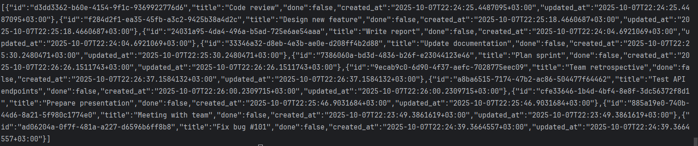

### 3. Получение списка задач с фильтром по title
```bash
curl -X GET "http://localhost:8080/api/v1/tasks?title=meeting"
```
Результат:
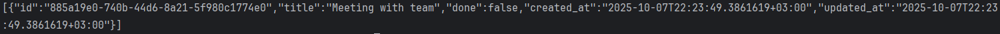

### 4. Получение списка задач с пагинацией
```bash
curl -X GET "http://localhost:8080/api/v1/tasks?page=2&limit=5"
```
Результат:
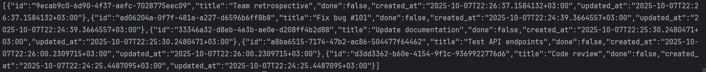

### 5. Получение списка задач с фильтром и пагинацией
```bash
curl -X GET "http://localhost:8080/api/v1/tasks?title=code&page=1&limit=2"
```
Результат:
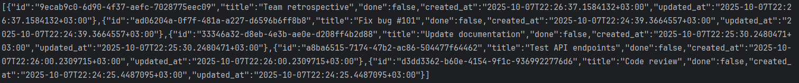

### 6. Создание задачи
```bash
curl.exe -X POST "http://localhost:8080/api/v1/tasks" -H "Content-Type: application/json" -d '{\"title\":\"New task\"}'
```
Результат:

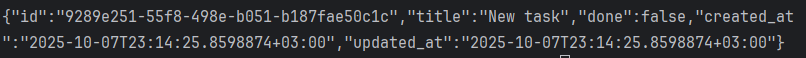

### 7. Создание задачи с пустым title (ошибка)
```bash
curl -X POST "http://localhost:8080/api/v1/tasks" -H "Content-Type: application/json" -d "{}"
```
Результат:

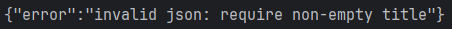

### 8. Создание задачи с коротким title (ошибка)
```bash
curl -X POST "http://localhost:8080/api/v1/tasks" -H "Content-Type: application/json" -d '{\"title\":\"ab\"}'
```
Результат:

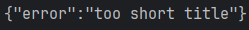

### 9. Получение задачи по ID
```bash
curl -X GET "http://localhost:8080/api/v1/tasks/24031a95-4da4-496a-b5ad-725e6ae54aaa"
```
Результат:

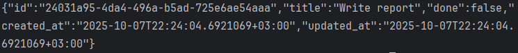

### 10. Получение несуществующей задачи (ошибка)
```bash
curl -X GET "http://localhost:8080/api/v1/tasks/999"
```
Результат:

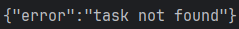

### 11. Обновление задачи
```bash
curl -X PUT "http://localhost:8080/api/v1/tasks/24031a95-4da4-496a-b5ad-725e6ae54aaa" -H "Content-Type: application/json" -d '{\"title\":\"Write report\",\"done\":true }'
```
Результат:

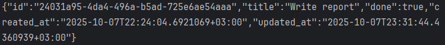

### 12. Обновление задачи с пустым title (ошибка)
```bash
curl -X PUT "http://localhost:8080/api/v1/tasks/24031a95-4da4-496a-b5ad-725e6ae54aaa" -H "Content-Type: application/json" -d "{}"
```
Результат:

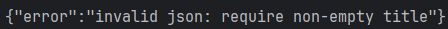

### 13. Обновление задачи с коротким title (ошибка)
```bash
curl -X PUT "http://localhost:8080/api/v1/tasks/24031a95-4da4-496a-b5ad-725e6ae54aaa" -H "Content-Type: application/json" -d '{\"title\":\"ab\",\"done\":false }'
```
Результат:

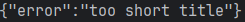

### 14. Обновление несуществующей задачи (ошибка)
```bash
curl -X PUT "http://localhost:8080/api/v1/tasks/999" -H "Content-Type: application/json" -d '{\"title\":\"Valid title\",\"done\":true }'
```
Результат:

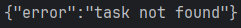

### 15. Удаление задачи
```bash
curl -X DELETE "http://localhost:8080/api/v1/tasks/24031a95-4da4-496a-b5ad-725e6ae54aaa"
```
Результат:
Ничего не выведено в консоль

### 16. Удаление несуществующей задачи (ошибка)
```bash
curl -X DELETE "http://localhost:8080/api/v1/tasks/999"
```
Результат:

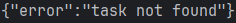


## Объяснение, как обрабатываются ошибки и коды ответа
В коде ошибки и коды ответа обрабатываются через универсальные функции `writeJSON` и `httpError`.

Хендлер проверяет корректность входных данных (JSON, параметры пути, валидацию title и id) и при ошибке сразу вызывает `httpError`, который формирует JSON с полем `error` и отправляет соответствующий HTTP-код клиенту (например, `400` для некорректного запроса или 404, если задача не найдена).

Если данные корректны и операция успешна, используется `writeJSON`, которая устанавливает нужный код ответа (`200` для получения/обновления, `201` для создания, `204` для удаления) и возвращает JSON с результатом.

## Результаты тестирования

| Маршрут                                              | Метод  | Query / Body                           | Ожидаемый ответ                       | Фактический ответ | Команда                                                                                                                          |
|------------------------------------------------------| ------ | -------------------------------------- |---------------------------------------|-------------------| ----------------------------------------------------------------------------------------------------------------------------------------- |
| `/health`                                            | GET    | —                                      | `"OK"`                                | Совпадает (п.1)   | `curl -X GET "http://localhost:8080/health"`                                                                                              |
| `/api/v1/tasks`                                      | GET    | —                                      | первые 10 задач                       | Совпадает (п.2)   | `curl -X GET "http://localhost:8080/api/v1/tasks"`                                                                                        |
| `/api/v1/tasks`                                      | GET    | `title=meeting`                        | задачи с "meeting" в title            | Совпадает (п.3)   | `curl -X GET "http://localhost:8080/api/v1/tasks?title=meeting"`                                                                          |
| `/api/v1/tasks`                                      | GET    | `page=2&limit=5`                       | задачи с 6 по 10                      | Совпадает (п.4)   | `curl -X GET "http://localhost:8080/api/v1/tasks?page=2&limit=5"`                                                                         |
| `/api/v1/tasks`                                      | GET    | `title=code&page=1&limit=2`            | первые 2 задачи с "code"              | Совпадает (п.5)   | `curl -X GET "http://localhost:8080/api/v1/tasks?title=code&page=1&limit=2"`                                                              |
| `/api/v1/tasks`                                      | POST   | `{"title":"New task"}`                 | созданная задача с id                 | Совпадает (п.6)   | `curl -X POST "http://localhost:8080/api/v1/tasks" -H "Content-Type: application/json" -d "{\"title\":\"New task\"}"`                     |
| `/api/v1/tasks`                                      | POST   | `{}`                                   | invalid json: require non-empty title | Совпадает (п.7)   | `curl -X POST "http://localhost:8080/api/v1/tasks" -H "Content-Type: application/json" -d "{}"`                                           |
| `/api/v1/tasks`                                      | POST   | `{"title":"ab"}`                       | too short title                       | Совпадает (п.8)   | `curl -X POST "http://localhost:8080/api/v1/tasks" -H "Content-Type: application/json" -d "{\"title\":\"ab\"}"`                           |
| `/api/v1/tasks/24031a95-4da4-496a-b5ad-725e6ae54aaa` | GET    | —                                      | задача с указанным id                 | Совпадает (п.9)   | `curl -X GET "http://localhost:8080/api/v1/tasks/1"`                                                                                      |
| `/api/v1/tasks/999`                                  | GET    | —                                      | task not found                        | Совпадает (п.10)  | `curl -X GET "http://localhost:8080/api/v1/tasks/999"`                                                                                    |
| `/api/v1/tasks/24031a95-4da4-496a-b5ad-725e6ae54aaa` | PUT    | `{"title":"Write report","done":true}` | обновлённая задача                    | Совпадает (п.11)  | `curl -X PUT "http://localhost:8080/api/v1/tasks/1" -H "Content-Type: application/json" -d "{\"title\":\"Updated task\",\"done\":true}"`  |
| `/api/v1/tasks/24031a95-4da4-496a-b5ad-725e6ae54aaa` | PUT    | `{}`                                   | invalid json: require non-empty title | Совпадает (п.12)  | `curl -X PUT "http://localhost:8080/api/v1/tasks/1" -H "Content-Type: application/json" -d "{}"`                                          |
| `/api/v1/tasks/24031a95-4da4-496a-b5ad-725e6ae54aaa` | PUT    | `{"title":"ab","done":false}`          | too short title                       | Совпадает (п.13)  | `curl -X PUT "http://localhost:8080/api/v1/tasks/1" -H "Content-Type: application/json" -d "{\"title\":\"ab\",\"done\":false}"`           |
| `/api/v1/tasks/999`                                  | PUT    | `{"title":"Valid title","done":true}`  | task not found                        | Совпадает (п.14)  | `curl -X PUT "http://localhost:8080/api/v1/tasks/999" -H "Content-Type: application/json" -d "{\"title\":\"Valid title\",\"done\":true}"` |
| `/api/v1/tasks/24031a95-4da4-496a-b5ad-725e6ae54aaa` | DELETE | —                                      | -                                     | Совпадает (п.15)  | `curl -X DELETE "http://localhost:8080/api/v1/tasks/1"`                                                                                   |
| `/api/v1/tasks/999`                                  | DELETE | —                                      | task not found                        | Совпадает (п.16)  | `curl -X DELETE "http://localhost:8080/api/v1/tasks/999"`                                                                                 |

## Выводы
Практическая работа оказалась довольно содержательной: удалось поработать с роутером chi и изучить работу с файловой системой, но в будущем данный проект можно улучшить путём доработки проекта до стандарта чистой архитектуры, а именно нужно добавить ещё одну структуру Service, а также добавить DI.
